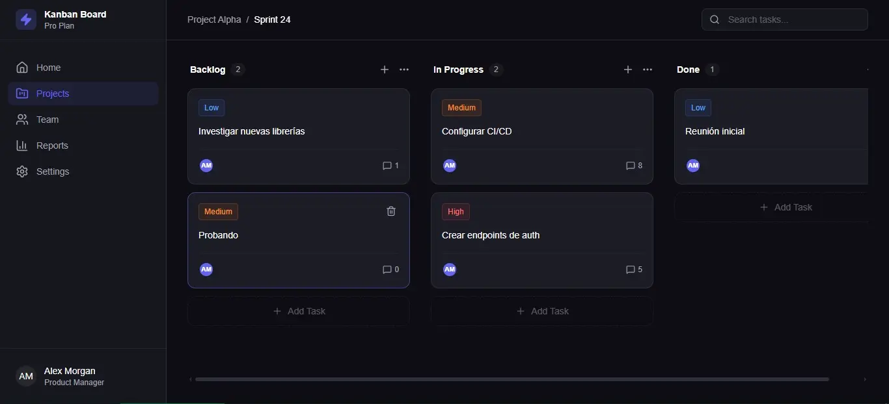

# Kanban Board - Professional Task Management

Un tablero Kanban moderno, performante y accesible construido con React y TypeScript. Diseñado para gestionar tareas con prioridades, persistencia de datos y una experiencia de usuario fluida (Drag & Drop).

 ## 🚀 Demo en vivo
[Ver Proyecto Online](https://optimizeflux.netlify.app/)

## 💻 Tecnologías Clave
* **Core:** React + TypeScript + Vite
* **Estado:** Zustand (con persistencia en LocalStorage)
* **Drag & Drop:** @dnd-kit (Core, Sortable, Modifiers)
* **Estilos:** Tailwind CSS
* **Iconos:** Lucide React

## ✨ Funcionalidades
* ✅ **Gestión de Tareas:** Crear, Editar (título, descripción, prioridad) y Eliminar.
* ✅ **Drag and Drop Avanzado:** Movimiento fluido entre columnas y reordenamiento.
* ✅ **Persistencia:** Los datos no se pierden al recargar (Middleware de Zustand).
* ✅ **Búsqueda en Tiempo Real:** Filtrado instantáneo de tareas.
* ✅ **Diseño Responsivo & Dark Mode:** Interfaz moderna estilo "SaaS".

## 🛠️ Instalación Local
1.  Clonar el repositorio
2.  `npm install`
3.  `npm run dev`